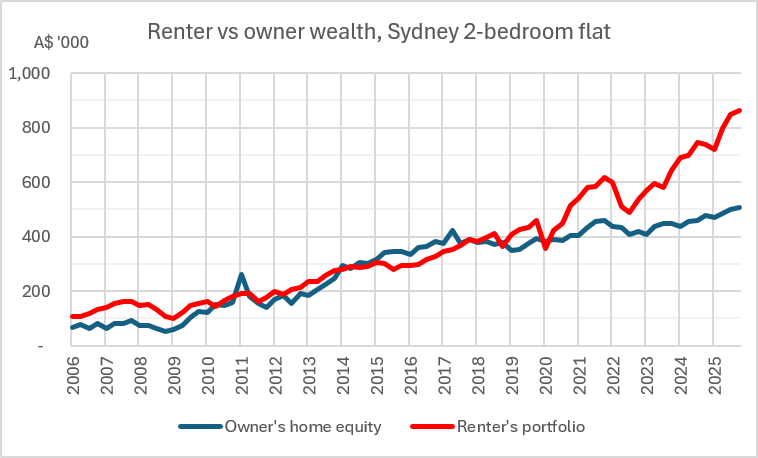
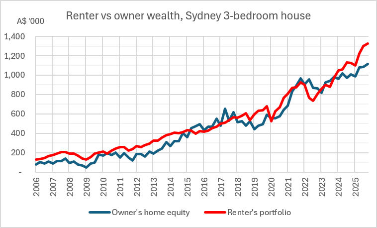
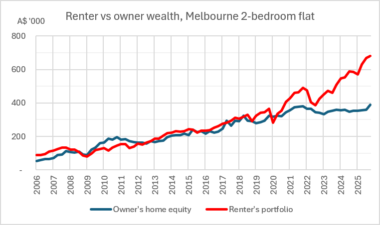
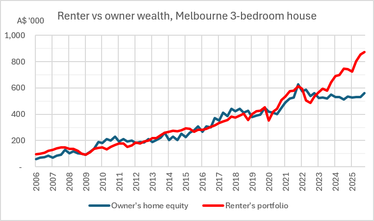
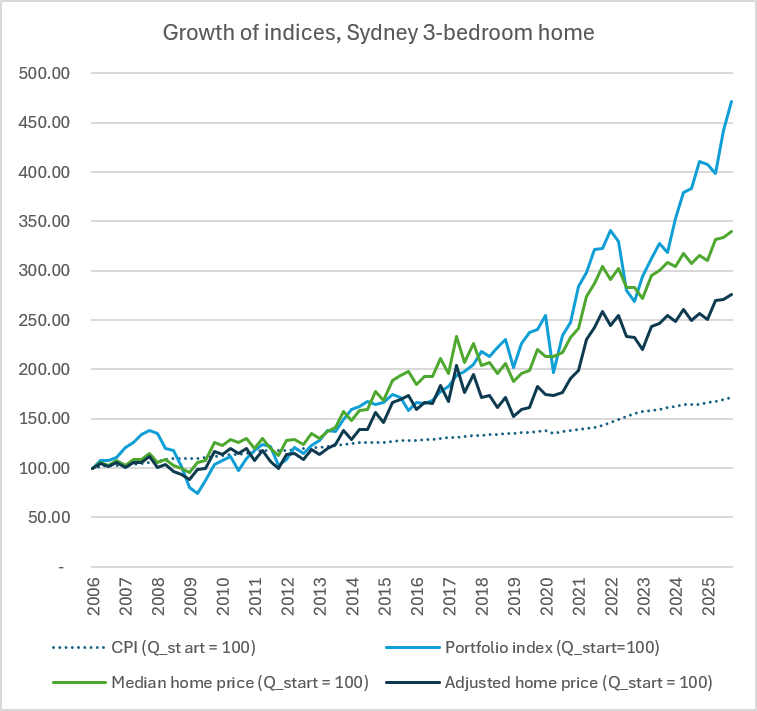

# Renting versus owning a home in Australia, 2006-2025

Hi everyone,

In 2025, Ben Felix made a series of YouTube videos in which he modelled buying a home in multiple Canadian cities and compared that to renting and investing the difference. Using historical data over twenty years, he showed that, despite conventional wisdom, renters in his model ended with higher wealth than comparable homeowners in major Canadian cities. These cities include Toronto (which I've never visited), Montreal (which I've never visited), and Winnipeg (which, by the way, is wonderful - the human rights museum is well worth a visit).

I wondered - what would the numbers look like for Australia? Though on the opposite sides of the world, Canada and Australia have similar housing markets. The Australian Dream of a quarter-acre suburban block with a front and back garden seem like a carbon copy of the Canadian (and for that matter American) Dream.

And in the past twenty years the (real and perceived) issues impacting the Canadian and Australian housing markets (and housing crises!) also seem similar. Landlords taking advantage of poor tenant protections and rental regulations. An array of issues being blamed for the spike in housing prices, from tax breaks for investment properties to rising construction costs and high rates of immigration. Increasing financial stress for both renters and mortgage payers.

Seeing how home prices have risen so greatly in their lifetime, and the social/cultural pressures favouring homeownership, it's clear why many Australians think owning a house is both necessary and sufficient for building wealth. But are they right? To answer that question, I've adapted the model presented by Mr Felix in his videos (and further detailed in a 2025 paper he co-wrote with Hamza Bin Arif) to analyse wealth outcomes of renting versus owning in Australian cities over the past 20 years, starting from January 2006 and ending in December 2025.

## Sydney and Melbourne renters ended with more wealth than owners, for both flats and detached houses 

I live in Sydney, the greatest city in the world. (I will accept Winnipeg as a close second.) Believing that it's the greatest city in the world helped a little bit, though not enough, when I faced 20% year-on-year rent increases from about 2022 to 2024. Not to mention how rents have grown by around 5% per year on average over the past 20 years.

So it was a surprise to me when I ran the analysis for (Greater) Sydney and found an ending renter-to-owner wealth ratio of 1.70 for two-bedroom flats. That is, the renter of an average two-bedroom flat ended up with 1.70 times the wealth of the owner of an equivalent flat after 20 years.

To put it another way, the owner had ended up with half a million Australian dollars in home equity - a tidy packet. But the renter-investor ended with over A$850k in a portfolio of 30% Australian and 70% global equities (invested at 0.25% p.a. expense ratio). Okay, I thought - everyone knows that after the early-2010s bubble of new high-rise flats in the inner city and the bust that came after, you don't expect capital appreciation for apartments. Detached houses are where it's at! The Australian Dream home would surely have a lot of money in it.

So I was even more surprised when renting beat out owning for Sydney three-bedroom detached houses as well, albeit at a narrower margin of 1.19. Although the house owner had amassed A$1.1 million in home equity, the renter's portfolio ended at A$1.3 million.

The story was similar for (Greater) Melbourne. The ending wealth ratio for 2-bedroom flats was 1.74 in favour of the renter, owing to Melbourne's sluggish growth in both apartment prices and rents over the past decade, especially post-Covid. Meanwhile, the Australian and global stock markets continued to make significant gains during that period, leading to a greater wealth gap in favour of the renter.

The gap was less stark for the Melbourne 3-bedroom detached house, where the renter and owner actually kept close to each other until 2023. But after that, with Melbourne house prices stagnating and the global recovery from the 2022 bear market, the renter's wealth overtook the owner's with the gap widening over the next two years.

What about other Australian cities? Good question. I've got the required data for Brisbane, Adelaide, and Hobart, and just need to process the data though that will take a while. As for Perth, Canberra, and Darwin, sadly I haven't been able to find any public data that is sufficiently disaggregated. In principle, I can also do the analysis for different parts of New South Wales and Victoria since the data I have is statewide, but I'm choosing to focus on the major cities for now.

## My model is based on that presented in Felix and Bin Arif (2025) and adapted for the Australian context

[comment]: <> (Now that I've shown the results, which will not be controversial at all and discussed in a temperate and civil manner, it's time to look at the methodology.)

Now that you've seen the results, let's look at the methodology. I've modified the model from Felix and Bin Arif to work with the available data and reflect Australian-specific factors (for instance, the fact that almost all Australian mortgages are variable-rate)

### Rents and related costs

The different Australian states and territories publish median rents for private housing, based on data for new rental bonds (security deposits), at different levels of aggregation and varying time periods. Both New South Wales and Victoria publish median rents for both houses and flats, separated by number of bedrooms, for every quarter since January 2006.

Sydney rent data is from the Rent and Sales Report published by the New South Wales Department of Communities and Justice (DCJ).

Melbourne rent data is from the Rental Report published by Homes Victoria.

Other states do not publish the equivalent data at such a neat and gift-wrapped level, so I'm going to have to get back to you all on what Brisbane, Adelaide, etc. look like.

[comment]: <> (Brisbane data is from QLD RTA, SA rent data is from private rent report by South Australian Housing Trust.)

We assume that the renter signs a year-long lease at the start of the scenario in January 2006 at the market rate, and then renews each year at the market rate.

There is an additional $150 per quarter (nominal) representing renter's insurance and other costs. This is a minor factor on the outcome. (But nonetheless I'm wondering why I didn't adjust this for inflation...)

### Investments

The model assumes that the renter invests the difference between their housing costs and the owner's housing costs at the start of each quarter into a portfolio of 30% Australian and 70% global shares tracking the MSCI Australia IMI (gross of dividends) and the MSCI World IMI (net of dividends) total return indices. The expense ratio is set at 0.25% per annum.

### Home prices

There are multiple available datasets for median home sale prices but none of them separate by number of bedrooms, only by type of dwelling (separate/established/detached houses and attached dwellings, i.e. flats/units). I have assumed that the median price detached house is comparable to the median 3-bedroom detached house available to both renters and homebuyers, and likewise for the median prices for all units and 2-bedroom units. This assumption is essentially that the home/unit in which the owner resides is comparable to the median 3-bed home/2-bed unit in which the renter resides, which is necessary for the model to make a fair comparison.

I think this assumption is justified because data from the Australian Census indicates that the median number of bedrooms in Australian houses is three, and that the median number of bedrooms for units is two. But I think the justification needs to be more rigorous, maybe by comparing assumed home rents and prices with Census data for time periods where that data is available.

The home price data is separated not by dwelling type but by ownership structure (strata versus non-strata, strata being the Australian equivalent of a condominium). However, I have assumed that strata properties are broadly equivalent to flats and non-strata properties are broadly equivalent to detached houses.

Sydney price data is from the DCJ Rent and Sales Report. 

Melbourne price data is from the Australian Bureau of Statistics Total Value of Dwellings report.

### Home loan (mortgage) costs

The model assumes that the owner buys the house with a 20% deposit and variable-rate home loan (mortgage) at a 25-year term. These terms are the most common in Australia.

The home loan rate is the variable discounted owner-occupier rate from the Reserve Bank of Australia's quarterly indicator lending rates dataset.

### Home transaction costs

For real estate agent commissions, I have assumed 1.5% of the home value on top of the price when purchasing the home, and 1.5% again when selling the home, according to Kaczerepa (2022).

When purchasing the home, the 1.5% commission is added to stamp duty, which is calculated as it would have been on 1 January 2006. The calculated stamp duty ranges from 3.31% to 4.68% of the home purchase price, depending on the state and home price. This 4.8%-6.1% cost is added to the owner's cashflow costs.

(The relevant stamp duty legislation is the _Duties Act 1997_ (NSW) effective 7 December 2005, and _Duties Act 2000_ (Vic) effective 1 January 2006)

When selling the home, an additional 0.5% in other costs is added to the 1.5% commission to form the total cost of selling the home. This 2% is deducted from home equity.

### Depreciation, maintenance, and renovation costs

Felix and Bin Arif use 1% of home prices for depreciation and 1/3 of gross rents for maintenance, with the simple average for both in their sample of Canadian cities being 2.66% of home prices.

Fox and Tulip 2014 (refer to Tables 1, A2) look at 2010-11 tax statistics from the Australian Tax Office (ATO) and calculate home ownership running costs (council rates, maintenance, and plant depreciation) of 35.8% of rental income or 1.5% of property value. Using the same method with 2022-23 ATO data gets between 29.3% in Western Australia and 40.6% in Queensland with a simple average of 33.2% so the methodology still holds up.

The model has 35% of rent to cover total home ownership running costs, or 1-1.5% of home prices. This is represented as an additional cashflow cost.

Fox and Tulip also cite Stapledon (2007, 2012) who states that from 1960-2005, alterations and renovations contributed 1.15 percentage points a year to home value and depreciation reduced home values by 1.06 percentage points a year.

I have chosen to model the owner's home depreciating in value by 1% of the original purchase price per year, and reduce home price growth by 1.15 percentage points per year to account for renovations and alterations.

As the chart shows, the adjusted home price is quite a bit lower than the median home price. This is appropriate because the median home in 2025 is not the median home in 2006 that the owner bought, and that part of the reason home prices have grown is because of renovations which represents an investment cost. To accurately compare the wealth outcomes of homeownership with an alternative, the model cancels out the effect of renovations on aggregate housing prices.

## Modelling taxes and superannuation changes the margins but not the winners

This analysis was done without considering the effect of taxes. The owner pays the mortgage and other costs with post-tax money, and the renter pays the rent and invests the difference with the same post-tax money.

Modelling the effect of taxes would have made the analysis more complicated while reducing the applicability of the results to people's real-life situations. Accurately modelling taxation would have required specifying many more details including personal income, assets, and withdrawal rates. All that just to get outdated post-tax outcomes anyway, thanks to the Albanese Government's capital gains tax changes in the budget last May.

That said, accounting for capital gains tax (which is not charged on owner-occupied homes) has a moderate effect on the outcome. For example, modelling the 50% capital gains discount method that applied during this time period (and was repealed in the May budget) led the ending wealth ratio for Sydney 3-bedroom houses to decrease from 1.19 to 1.06. Still favouring the renter, but only just.

On the other hand, considering superannuation would have led to even higher relative wealth for the renter. The owner has to pay mortgage with their post-tax money, while the renter has the option of investing through super and gaining a tax break. Investing through super would have led the ending wealth ratio for Sydney 3-bedroom houses to increase to 1.39.

## Thank you for reading, and I welcome all comments and feedback

I've been a long-term viewer of Ben's videos, moderate-time lurker of this forum and first-time poster. So I'm really excited to share this work and I hope this is a welcome contribution to the forum. I chose to post this here because I think there would be a lot of good constructive criticism and feedback.

When I've done the analysis for more cities and potentially refined the model, I plan to add to what I've written here and publish it on my website (https://hattamisra.github.io/), along with accompanying documents (such as the Excel spreadsheets) as well.

(All views in this post are my own and do not represent those of any of my employers, past or present.)

Thanks for reading,

Hatta

## Works cited

Australian Bureau of Statistics (2026). Total value of dwellings (March quarter 2026). Australian Government. <https://www.abs.gov.au/statistics/economy/price-indexes-and-inflation/total-value-dwellings/latest-release>. Retrieved 6 June 2026.

Australian Taxation Office (27 June 2025). Taxation statistics 2022-23. ATO. <https://www.ato.gov.au/about-ato/research-and-statistics/in-detail/taxation-statistics/taxation-statistics-previous-editions/taxation-statistics-2022-23>. Retrieved 03 April 2026.

_Duties Act 1997_ (NSW) §32. Version effective 07 December 2005. <https://legislation.nsw.gov.au/view/html/inforce/2005-12-07/act-1997-123#sec.32> 

_Duties Act 2000_ (Vic) §28. Version effective 01 January 2006. <https://www.legislation.vic.gov.au/in-force/acts/duties-act-2000/046>

Felix, Benjamin and Hamza Bin Arif (2025). Renting vs owning a home in Canada 2005-2024. PWL Capital. <https://pwlcapital.com/renting-vs-owning-a-home-in-canada-2005-2024/>

Fox, Ryan and Peter Tulip (July 2014). Is housing overvalued? Research Discussion Paper (RDP) 2014-06, Reserve Bank of Australia. <https://www.rba.gov.au/publications/rdp/2014/2014-06/>

Homes Victoria (n.d.). Rental report - quarterly: quarterly median rents by LGA. Victorian Government. <https://discover.data.vic.gov.au/dataset/rental-report-quarterly-quarterly-median-rents-by-lga>. Retrieved 29 March 2026.

Kaczerepa, Gemma (20 September 2022). "Real estate commissions: How does it work and how much should you be paying?" Realestate.com.au. <https://www.realestate.com.au/advice/real-estate-agent-commissions/>. Retrieved 01 April 2026.

New South Wales Department of Communities and Justice (n.d.). Housing rent and sales [rent and sales report]. New South Wales Government. <https://dcj.nsw.gov.au/about-us/families-and-communities-statistics/housing-rent-and-sales.html>. Retrieved 29 March 2026.

Reserve Bank of Australia (n.d.). Lenders' interest rates. RBA. <https://www.rba.gov.au/statistics/interest-rates/>. Retrieved 29 March 2026.